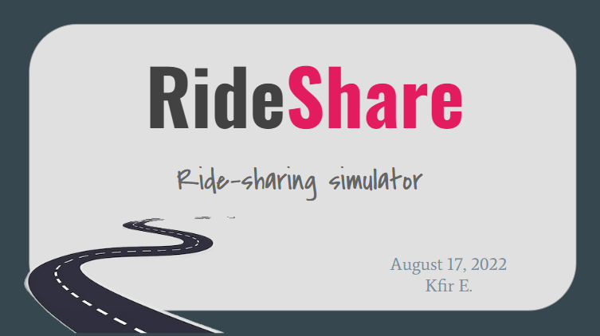

# RideShare

Ride-sharing simulator for research and simulator development.
Multithreaded simulator for ride-sharing for research and simulator development.

The project parts:
* Osm file processing for custom roadmap and 2 built in roadmaps: Tel Aviv, and Berlin.
* Multithreaded simulator.
* Gui.


Algorithms:
* Shortest path with multiple stops algorithms (TSP/SHPP on steroids).
* Matching algorithm.




## Author

- [@kfiree](https://github.com/kfiree)


## Run Locally

Clone the project

```bash
  git clone https://github.com/kfiree/RideShare.git
```

Go to the project directory

```bash
  cd RideShare
```

Install dependencies

```bash
  mvn clean
  mvn install
```

run via cmd:
```bash
Usage: rideShare.exe  [.pbf map path] [-n] [-s] [-l] [-b] [-c] 

Options:
    -m                      Load PBF file (use saved map otherwise).
    -s speed                Speed of simulator.
                            Default: 10.
    -l log-level            Log level for console can be a number or a string value of 'java.util.logging.Level'.
    -b 'y'/'n'              Set bounds to the map.
    -c max/min coordinates  Set bounds coordinates - top latitude, bottom latitude, top longitude, bottom longitude.
                            Default: value will show center of israel.
```
run example:
```bash
java -jar RideShare.jar   -s 10  -l ALL  -b y
```

or via GUI:

## GUI Screenshots

Map chooser view:


Simulator view:


Simulator view:


## TODO (future work)

* Use DeepPool for matching (AI).
* 
